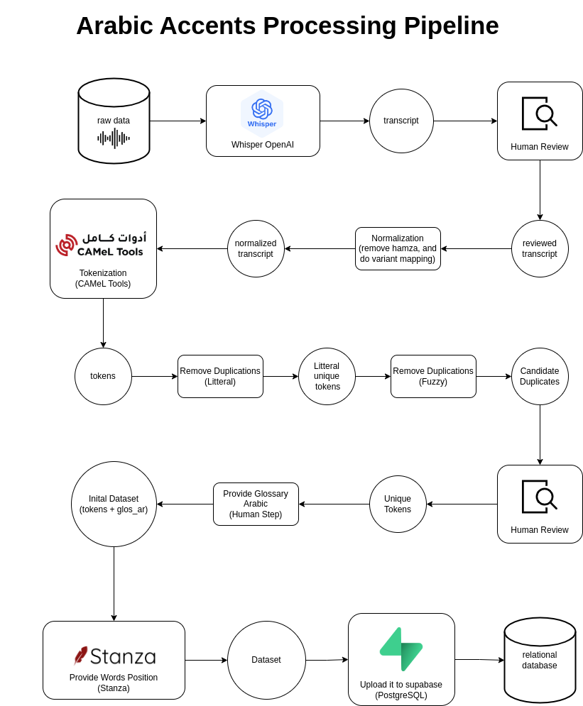

# Latakian-Accent-ETL-Pipeline

## TL;DR
A complete ETL (Extract–Transform–Load) pipeline for building a structured Latakian Arabic dialect database from raw voice recordings. The system automates transcription, text normalization, tokenization, deduplication, POS tagging, and data loading into a PostgreSQL (Supabase) backend.

## 📖 Overview
The **Latakian Accent ETL Pipeline** is a complete Extract–Transform–Load workflow designed to build a structured database of words from the Latakian Arabic dialect.  
It processes raw voice recordings into a clean, tokenized, and linguistically annotated dataset ready for analysis or AI model training.

---

## Pipeline Stages

| Stage | Description | Tool |
|-------|--------------|------|
| **Extract** | Convert audio into text using OpenAI Whisper | Whisper |
| **Transform** | Normalize and tokenize Arabic text | Python, CAMeL Tools |
| **Deduplicate** | Remove literal and fuzzy duplicates | RapidFuzz |
| **Enrich** | Add POS tags using Stanza | Stanza |
| **Load** | Upload dataset to PostgreSQL via Supabase | Supabase Python SDK |

---

## ⚙️ Features
- 🎙️ **Audio Transcription:** Converts Arabic dialect speech into text.
- 🧹 **Normalization:** Cleans and unifies Arabic script (removes diacritics, elongations, noise).
- ✂️ **Tokenization:** Splits text into meaningful words or phrases.
- 🔍 **Deduplication:** Detects and flags near-duplicates using fuzzy matching.
- 🧠 **POS Tagging:** Automatically labels words as noun, verb, etc., using **Stanza (Stanford NLP)**.
- 🗄️ **Data Loading:** Uploads processed data to a cloud PostgreSQL database (Supabase).

---

## Database Schema
| Column | Description |
|--------|-------------|
| `id` | Unique identifier |
| `dialect_region` | Dialect region (e.g., Latakian, Damascene, etc.) |
| `word_or_phrase` | Dialect word or phrase |
| `gloss_ar` | Meaning in Modern Standard Arabic |
| `pos` | Part of Speech |
| `source` | Origin or context of the word |
| `filename` | Audio file associated with the source |
| `source_url` | Reference or citation link |

---

## 👤 Author

Mohammad Hamdan
